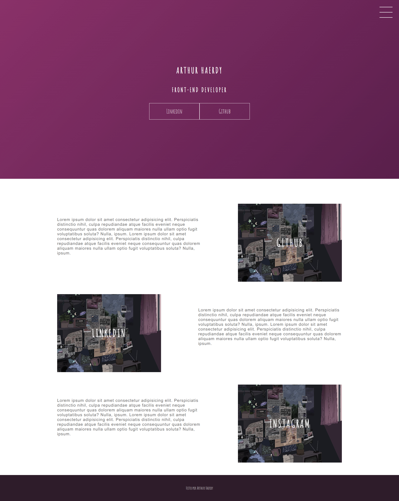

# Landing Page com Menu Hamburguer e Morphing Menu (CSS)

## Visão Geral do Projeto

Este projeto consiste em uma **landing page responsiva** construída exclusivamente com **HTML5 e CSS3**, sem nenhuma linha de JavaScript. O objetivo central foi demonstrar o domínio de recursos avançados de CSS para controle de estado, animações e interatividade — competências que comprovam maturidade técnica em desenvolvimento front-end.

---


## Índice

- [Visão Geral do Projeto](#visão-geral-do-projeto)
- [Resultado Visual](#resultado-visual)
- [Tecnologias e Conceitos Aplicados](#tecnologias-e-conceitos-aplicados)
- [Arquitetura e Estrutura do Projeto](#arquitetura-e-estrutura-do-projeto)
- [Relatório Técnico — HTML](#relatório-técnico--html)
- [Relatório Técnico — CSS](#relatório-técnico--css)
- [Considerações Finais](#considerações-finais)

---

### Objetivos Alcançados

| Objetivo | Técnica Utilizada |
|---|---|
| Menu hamburguer animado | Seletor `:checked` + `transition` |
| Efeito de expansão circular (morphing) | `box-shadow` com `vmax` |
| Gradiente animado no hero | `@keyframes` + `background-position` |
| Cards interativos com hover | Pseudo-elemento `::before` + `transition` |
| Layout responsivo | Flexbox + `@media` queries |
| Controle de estado sem JS | `<input type="checkbox">` + seletor `~` |

---

## Resultado Visual

### Estado Inicial — Landing Page

> Visualização da página com o menu hamburguer fechado, hero section com gradiente animado e cards de apresentação.



---

### Estado Ativo — Morphing Menu Aberto

> Ao clicar no ícone hamburguer, um círculo branco expande cobrindo toda a tela (morphing), os três traços se transformam em um "X" e o menu de navegação torna-se visível — tudo controlado exclusivamente por CSS.


---

## Tecnologias e Conceitos Aplicados

```
HTML5       → Semântica, estrutura e acessibilidade
CSS3        → Estilização, animações e controle de estado
Flexbox     → Alinhamento e distribuição de layout
Transitions → Animações de propriedades CSS
@keyframes  → Animação contínua do background
Media Query → Responsividade para mobile (< 800px)
```

---

## Arquitetura e Estrutura do Projeto

```
📁 raiz do repositório
├── 📄 index.html              ← Estrutura da página
├── 📄 style.css               ← Toda a lógica visual e animações
├── 🖼️ room.jpg                ← Imagem de fundo dos cards
└── 📁 000-Midia_e_Anexos/
    ├── 🖼️ captura_01.jpg      ← Screenshot: página inicial
    └── 🖼️ captura_02.jpg      ← Screenshot: menu ativo
```

---

## Relatório Técnico — HTML

### 1. Configuração Base do Documento

```html
<!DOCTYPE html>
<html lang="en">
<head>
    <meta charset="UTF-8">
    <meta name="viewport" content="width=device-width, initial-scale=1.0">
    <link rel="stylesheet" href="style.css">
</head>
```

**Decisões técnicas:**
- `DOCTYPE html` garante renderização no modo padrão HTML5, evitando o quirks mode dos navegadores.
- `charset="UTF-8"` habilita suporte completo a caracteres especiais e acentuação.
- A meta `viewport` com `initial-scale=1.0` é fundamental para responsividade correta em dispositivos móveis — sem ela, navegadores mobile aplicam zoom automático e quebram o layout.
- O CSS é carregado externamente, separando responsabilidades e facilitando manutenção.

---

### 2. Estrutura do Menu Hamburguer (sem JavaScript)

```html
<div class="checkbox-wrapper">
    <input type="checkbox" id="toggle">
    <label class="checkbox" for="toggle">
        <div class="trace"></div>
        <div class="trace"></div>
        <div class="trace"></div>
    </label>
    <div class="menu"></div>
    <nav class="menu-items">
        <ul>
            <li><a href="#">Home</a></li>
            <li><a href="#">Sobre</a></li>
            <li><a href="#">Projetos</a></li>
        </ul>
    </nav>
</div>
```

**Padrão arquitetural aplicado — *Checkbox Hack*:**

Este é o ponto técnico mais sofisticado do projeto. A lógica é inteiramente baseada em CSS puro:

1. O `<input type="checkbox" id="toggle">` funciona como **variável de estado** booleana.
2. O `<label for="toggle">` é o elemento clicável visível — qualquer clique nele alterna o estado do checkbox.
3. O checkbox em si é ocultado com `display: none`.
4. O CSS captura o estado `checked` via seletor `:checked` e propaga os efeitos visuais aos irmãos subsequentes usando os seletores `+` (adjacente) e `~` (irmão geral).

Os três `<div class="trace">` representam as linhas do ícone hamburguer que serão individualmente animadas para formar um "X".

---

### 3. Hero Section e Conteúdo Principal

```html
<header class="header-wrapper">
    <!-- menu hamburguer -->
    <h1>Arthur Haerdy</h1>
    <h2>Front-end Developer</h2>
    <div class="social-media">
        <a href="#">Linkedin</a>
        <a href="#">Github</a>
    </div>
</header>
```

O uso de `<header>` é semântico — indica ao navegador e a leitores de tela que este bloco representa o cabeçalho principal da página, contribuindo para acessibilidade e SEO.

---

### 4. Cards Interativos

```html
<div class="card-container">
    <div class="card-text"> Lorem ipsum... </div>
    <div class="card">
        <div class="card-wrapper">
            <h2>Github</h2>
            <p>Veja meus projetos!</p>
        </div>
    </div>
</div>
```

Os três cards seguem um padrão de **layout alternado** (texto-card / card-texto / texto-card), criando ritmo visual na página. No mobile, o CSS inverte a ordem dos cards 1 e 3 via `flex-direction: column-reverse` para manter a coerência da leitura.

---

## Relatório Técnico — CSS

### 1. Gradiente Animado no Hero

```css
.header-wrapper {
    background: linear-gradient(-45deg, #050404, #2E1C2B, #4A1942, #893168);
    background-size: 400% 400%;
    animation: backgroundTransition 8s ease-in-out infinite;
}

@keyframes backgroundTransition {
    0%   { background-position: 0% 80%; }
    50%  { background-position: 80% 100%; }
    100% { background-position: 0% 90%; }
}
```

**Técnica aplicada:** O gradiente é definido com `background-size: 400% 400%`, tornando-o 4x maior que o elemento. A animação `@keyframes` desloca a posição do fundo ciclicamente, criando o efeito de **gradiente em movimento** com transição fluida entre as 4 cores da paleta. O ângulo `-45deg` adiciona dinamismo visual à diagonal.

---

### 2. Controle de Estado via CSS — Transformação dos Traços

```css
/* Estado padrão dos traços */
.checkbox .trace:nth-child(1) { top: 26px; transform: rotate(0); }
.checkbox .trace:nth-child(2) { top: 46px; transform: rotate(0); }
.checkbox .trace:nth-child(3) { top: 66px; transform: rotate(0); }

/* Quando o checkbox está marcado (:checked) */
#toggle:checked + .checkbox .trace:nth-child(1) {
    transform: rotate(45deg);
    background-color: #2E1C2B;
    top: 47px;
}
#toggle:checked + .checkbox .trace:nth-child(2) {
    transform: translateX(-100px);
    visibility: hidden;
    opacity: 0;
}
#toggle:checked + .checkbox .trace:nth-child(3) {
    transform: rotate(-45deg);
    background-color: #2E1C2B;
    top: 48px;
}
```

**Lógica da animação "hamburguer → X":**
- O **traço 1** rotaciona `+45°` e desce ao centro.
- O **traço 2** desliza `100px` para fora da tela e desaparece com `opacity: 0`.
- O **traço 3** rotaciona `-45°` e sobe ao centro.
- Os traços 1 e 3 se cruzam exatamente na mesma posição (`top: 47px` / `top: 48px`), formando o "X".
- A `transition: 0.5s ease-in-out` no `.trace` garante que toda essa transformação aconteça de forma suave.

---

### 3. Efeito Morphing — Expansão Circular

```css
.menu {
    position: absolute;
    top: 28px;
    right: 30px;
    height: 40px;
    width: 40px;
    border-radius: 50%;
    box-shadow: 0px 0px 0px 0px white;
    z-index: -1;
    transition: 400ms ease-in-out 0s;
}

#toggle:checked ~ .menu {
    box-shadow: 0px 0px 0px 100vmax white;
    z-index: 1;
}
```

**Técnica avançada — `box-shadow` como efeito de expansão:**

Este é o recurso CSS mais criativo do projeto. Em vez de animar `width`/`height` (que causaria reflow no layout), utiliza-se o **`box-shadow`** — que é puramente visual e não afeta o fluxo do documento. A unidade `100vmax` garante que a sombra sempre cubra toda a tela independentemente de qualquer resolução, pois `vmax` é relativo ao maior entre largura e altura da viewport. O `z-index` é manipulado junto com o estado para garantir que o fundo expandido fique corretamente sobreposto à página mas abaixo dos itens do menu.

---

### 4. Visibilidade dos Itens do Menu

```css
.menu-items {
    opacity: 0;
    visibility: hidden;
    transition: 400ms ease-in-out 0s;
}

#toggle:checked ~ .menu-items {
    visibility: visible;
    opacity: 1;
}
```

**Por que usar `visibility` + `opacity` em vez de apenas `display`?**

A propriedade `display: none` não é animável — o elemento simplesmente aparece ou desaparece sem transição. Usando `visibility: hidden` + `opacity: 0`, o elemento permanece no DOM mas é invisível e não recebe eventos de clique. A `transition` pode então animar o `opacity` suavemente. Quando ativado, `visibility: visible` + `opacity: 1` revelam o menu com um **fade-in fluido de 400ms**.

---

### 5. Cards com Hover Interativo via Pseudo-elemento

```css
.card-wrapper::before {
    content: '';
    position: absolute;
    height: 100px;
    width: 100px;
    border: 1px solid white;
    opacity: 0;
    transition: 0.3s;
}

.card:hover > .card-wrapper::before {
    height: 250px;
    width: 350px;
    opacity: 1;
}

.card-wrapper p {
    font-size: 0;
    visibility: hidden;
    opacity: 0;
    transition: 0.3s;
}

.card:hover > .card-wrapper p {
    opacity: 1;
    visibility: visible;
    font-size: 14px;
}
```

**Técnicas aplicadas:**
- O `::before` cria uma **borda decorativa animada** que expande ao redor do conteúdo no hover — efeito de "spotlight" sem nenhum elemento HTML extra.
- O texto `<p>` usa `font-size: 0` como ponto de partida da animação, garantindo que a transição de revelação seja suave. Combinar `font-size`, `opacity` e `visibility` cria um efeito de aparecimento refinado.
- `filter: grayscale(0.5)` no estado normal remove a saturação da imagem de fundo; no hover, `filter: unset` restaura as cores, dando feedback visual imediato.

---

### 6. Responsividade com Media Queries

```css
@media (max-width: 800px) {
    .social-media { flex-direction: column; }

    .card-container { flex-direction: column; }

    /* Reordena cards 1 e 3 para manter texto antes da imagem no mobile */
    .container .card-container:nth-child(1),
    .container .card-container:nth-child(3) {
        flex-direction: column-reverse;
    }

    .card { height: 250px; width: 250px; }
    .card-text { width: 90%; margin-top: 2rem; text-align: center; }
}
```

**Estratégia de layout responsivo:**

No desktop, os cards alternam entre `[texto | card]` e `[card | texto]`. No mobile, o `flex-direction: column` empilha os elementos. Para os cards 1 e 3 (que no desktop têm o texto à esquerda), o `column-reverse` garante que a imagem apareça **acima** do texto no mobile, mantendo a consistência visual e a hierarquia de leitura natural em todas as telas.

---

## Considerações Finais

Este projeto demonstra que é possível construir **interfaces modernas, animadas e completamente responsivas** sem depender de JavaScript para interatividade básica. O domínio dos seletores CSS avançados (`:checked`, `+`, `~`, `:nth-child`, `::before`, `:hover`) elimina dependências desnecessárias, resulta em código mais leve e desempenho superior.

### Competências Demonstradas

- ✅ Controle de estado de UI via CSS puro (*Checkbox Hack*)
- ✅ Animações com `@keyframes` e `transition`
- ✅ Manipulação avançada de `box-shadow` para efeitos visuais complexos
- ✅ Uso estratégico de pseudo-elementos (`::before`) para efeitos decorativos
- ✅ Flexbox para layout fluido e responsivo
- ✅ Semântica HTML5 e boas práticas de organização
- ✅ Media Queries com reordenação de elementos via `flex-direction`
- ✅ Código completamente comentado e documentado

## Referências:

- [Repositório de Estudos – Bootcamp TQI Fullstack Developer](https://github.com/ahaerdy/DIO-learning/tree/main/TQI%20Fullstack%20Developer)